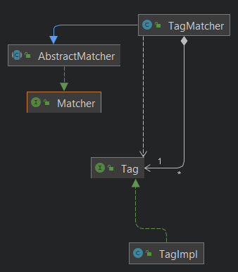

# JChef Phase 2 Write Up

## Contents

* [Introduction](#introduction)
* [Updated Specifications](#Updated-specifications)
* [How To Use](#how-to-use)
* [Class Diagram](#class-diagram)
* [Major Design Decisions](#major-design-decisions)
* [SOLID Design Principles](#SOLID-design-principles)
* [Clean Architecture](#clean-architecture)
* [Our Use of GitHub Features](#our-use-of-github-features)
* [Packaging Strategies](#packaging-strategies)
* [Design Patterns](#design-patterns)
* [Refactoring](#refactoring)
* [Testing](#testing)
* [Progress report](#progress-report)

## Introduction
JChef is a comprehensive full stack application that serves as a portable, interactive cookbook and shopping list. In the second phase of our development we were able to link our backend code to a user interface allowing for users to enjoy a convenient Android application that improves efficiency in the kitchen and in the store.

## Updated Specifications
We met our aims from the 1st phase of the applications' development. We were able to unify our grocery list and fridge command. We added commands that improve the users accessibility and are more efficient.
We implemented a scrolling list for all our storages to improve the accessibility. 

## How to Use
This application is a comprehensive, interactive cookbook. The user will open the app and will be presented with a UI offering a number of potential options.

**Fridge**

The user will be able to add ingredients that they have in real life to their virtual fridge by clicking the “add to fridge” button and inputting a string of the ingredient.

**Grocery list**

If there are items missing from their fridge that are needed for a recipe, the  user can add the ingredients to a “Grocery List” by pressing the button “add to grocery list”. This serves as a shopping list that is portable and efficient. Once the user gets the item they can automatically add the item to the Fridge and remove it from the Grocery list. The user can remove them from the grocery list all at once by clicking “Add All To Fridge”,  or one by one by using the “Add to Fridge” button.

**Recipes**

Once the user has added their available ingredients the user will be able to search the recipe list using a number of filters, the app will provide recipes based on the ingredients presented in their fridge.
Each recipe has a list of tags like “Gluten Free” that can be used to filter the recipes. The app will return the “best” recipes for the user to make. The user can click on a recipe to view it’s instructions and it’s ingredients.

## Class Diagram
Phase 0 Class Diagram:

Phase 1 Class Diagram:

phase 2 class Diagram

## Major Design Decisions
In the home stretch of development for our application we were largely content with our design from phase 1. 

We made decisions regarding the following:

- **Serialization**
    - In order to save the state of our program we have utilised the generic “rows” that represented our entities raw data and a new set of serializers to transform our entities back into rows.
    - These rows can then be saved to persistent storage by a writer.
    - Since the rows are not tied to a single type of entity, so we only need one writer to save every entity!

- **Android UI**
    
    - We had decided to get our app running on an Android GUI to allow for more complex menus and user interactions.
    - There was a lot of difficulty in getting the Android SDK, Intellij, and our code base to work together.
    - See Demo of UI here: https://user-images.githubusercontent.com/63621073/141885958-6550067a-2fd5-4a36-be36-8d844f436892.mp4 (Note that the UI will be connected to the backend in Phase 2)

- **Applying Decorator Pattern**

  - We decided that the abstraction of our RecipeItem class created redundant code and was violating the open close principal. 
  - We decided to shift to the decorator design pattern. This allows for specific display behavior for different types of RecipeItems.
  - This allows for new units of measurement to be easily added to the application.

## SOLID Design Principles
- **Single Responsibility Principle**
    - When designing our classes originally we were adamant to remember the SRP and as such have all classes kept to a contained responsibility.
    - In a class like `JSONFileIO` we had to debate whether there were multiple responsibilities at play. The class was a loader and writer for JSON files.
    - Some thought it should only load or only write and that these were separate responsibilities.
    - Others thought that since the action of reading and writing JSON are so closely related they only change for the same reasons. This is what we have decided on for now.
- **Open/Closed Principle**
    - A specific show our adherence to this principle is in our new decorator pattern for displaying recipe items. We needed to have an easy way to create different displays (such as changing units) but did not want to constantly create subclasses of recipe items to change the displays.
    - So, we replaced the display with a delegated display object which meant we could leave the initial set up for displaying intact and instead just describe the method of display rather than replacing the existing setup.
- **Liskov Substitution Principle**
    - During phase 2, we identified a violations of LSP within JChef which we have fixed. We did not identify any other violations.
    - The error was within the Response class. Subclasses of this were overriding methods incorrectly which meant they would not act correctly as a response. We fixed this by going through each subclass and removing these faulty implementations. See #77 and #79.
- **Interface Segregation Principle**
    - As part of our work on the SRP, we have in effect kept interfaces small as well. If we were to add too many moving parts to interfaces we noticed that our classes began to take on more work.
    - This alerted us to issues of ISP before they could even be.
    - As well, by splitting interfaces often, we could have clients using those interfaces use more abstract interfaces as often as possible.
- **Dependency Inversion Principle**
  
    - Here is a snippet from parts of our high level matchers.
    - In this case, we can see that the Tag dependency has been inverted so that the matcher does not know about the underlying implementation of the Tag class.

## Clean Architecture
- **Entities**
    - Our entities are built through generic Row objects and loaders / writers to keep storage details away from our data.
    - Thus, the entities do not depend on anything when storing and modifying data
- **Command/Response Classes**
    - Command/response classes keep use cases ignorant of the UI behind it.
    - Use cases are given command interfaces to perform actions on.
- **Matchers and Scorers**
    - These high-level objects do not care about implementation of anything other than the interfaces of existing storages and entities.
    - Not the case for the Scorers since they are being designed to have hard-coded values
        - Could potentially include a method in the matchers to return weights, and then overload the Scorer

## Our Use of GitHub Features
- **Issues**
    - We used issues to create a list of tasks that were assigned to group members
    - They could check things off in the checkboxes and use the reply feature to get clarification from other group members
    - 
- **Branches**
    - Consistently branched off of the main branch to work on individual parts of code
    - Commit messages were always informative and explained what was being changed
    - 
- **New Issues**
  - Taking feedback from phase 1 we created new issues that specifically outlines tasks that would improve the project. 

## Packaging Strategies
- Initially, we started with a strategy which was just everything grouped into related interfaces / functionality. So adhering to Clean Architecture, we packaged things by Feature.
- As a result, this meant parts of the system that worked together may be far apart (IE entity builders and interfaces are separate).
- To combat this, we have since changed to a more nested strategy to keep Components of the system grouped together. IE entities and builders, storages, loaders and writers. Thus, we are still following Clean Architecture by implementing packaging by Components.
- 

## Design Patterns
- **Facade Design Pattern**
    - In order to lazy load and reference entities we created a Referenced entity classes.
    - These are facades for the entity beneath and simply wrap the safe retrieval of lazy loaded entities.
- **Builder Design Pattern**
    - We used this for Entity Construction.
    - By using the Builder design pattern, we were able to construct different immutable objects step by step, and the builder is independent of other objects.
- **Decorator Design Pattern**
  - We used this to reduce the redundancy in code, we changed an abstract class with multiple subclasses to a single decorator class for the RecipeItem. 
  - This allows for specific display behaviour to be demonstrated when needed. For example RecipeItem, can be displayed using grams, ml or a quantity amount.

## Refactoring
Some major refactors include:
- Our switch of packaging strategies
- Introduced builders for “intermediate” entities. Lead to significantly easier time loading.
- Later we also extracted common builder interfaces to better help with loading.
- Overhaul of Storage interfaces to utilise the Collections interface.
- In phase 2 we Had to change our project structure and our CI to allow the UI to compile with our backend. 

## Testing
We have extensive testing, covering nearly all our classes with more than one test. We used test
driven architecture which allowed for a significant amount of testing.  

## Progress Report

Throughout the development of JChef we encountered many obstacles, of which we’ve worked hard to overcome. However, as mentioned earlier, there are many questions our group addressed in Phase 2. This includes addressing:
- Managing the file structure to correct the build errors. This will help us:
    - Connect the backend to the Android GUI to make the application holistically functional
    - Create a more robust testing system to ensure the application works as intended
    - Allow us to address all IntelliJ warnings and style concerns

In spite of the aforementioned concerns, we believe JChef’s current design to be effective for a multitude of reasons.

Because we followed clean architecture and the SOLID principles, as mentioned before, our codebase is easy to understand and led to good stratification in terms of levels. Our compartmentalized code base is conducive to scalability and the implementation of new features. As well, general maintenance was easy.

For instance, consider our Recipe Items: This class was turned into two different subclasses in Phase 1, but it didn't affect the rest of the code base as the implementation was done using the same interface.

These principles will allow us to address the shortcomings in Phase 1. This was then changed in phase 2 again to decorator design pattern. 

**Regarding Phase 2 Contributions:**
- Ariel: Refactored the use cases, refactored the responseImpl class and create the controllers. 
  - significant PR :
- Ayush: Worked on the Android GUI redesigning some components and hooking it up to the back end.
    - significant PR:
- Derek: Did a lot of general work reviewing code and looking at the architecture of the program. The accessibility Documents.
  - significant PR:
- Ezra: The Design Doc and the Presentation. Helped Ariel with the use cases, created the presentation. 
    - significant PR:
- Gerd: created a decorator design pattern for the recipeItem, refactored a large amount of concluding the matchers and scored and all the associated tests we remade. He also fixed the builders.
    - significant PR:
- Prithee: Worked on the Android GUI redesigning some components and hooking it up to the back end, added the Grocery list use case.
    - significant PR
      
**Reflection Moving Forward:**
* Having an API connected to our application with lists of recipes and ingredients
* We wish we could have added photos to our recipes
* We wish we could have implemented our Tinder like function for the application when searching for recipes. 
